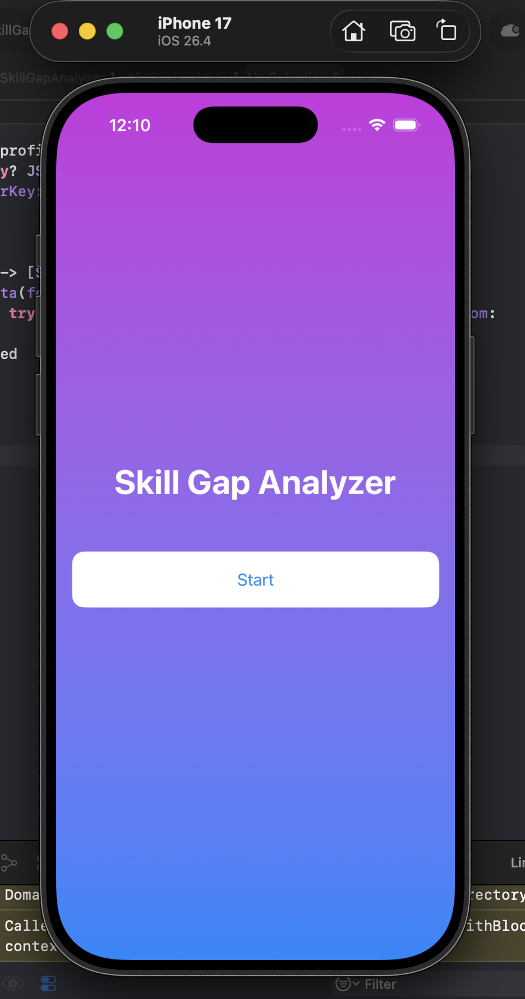
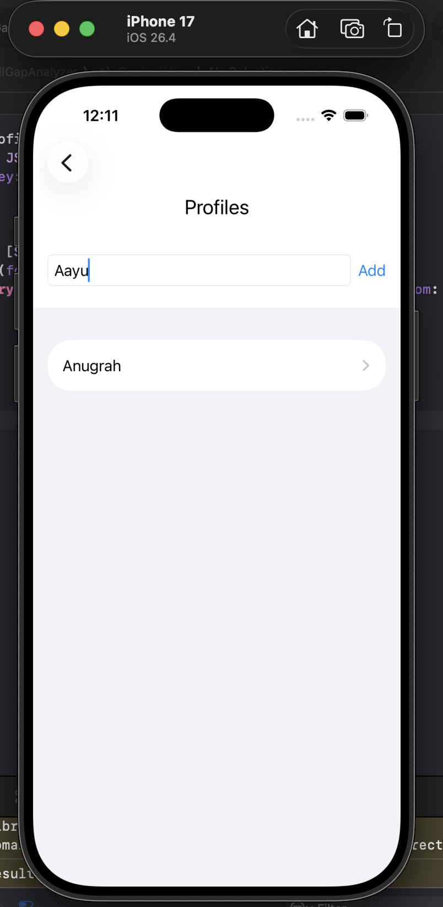
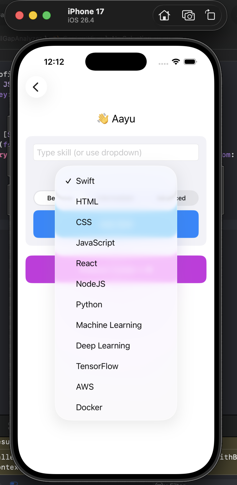
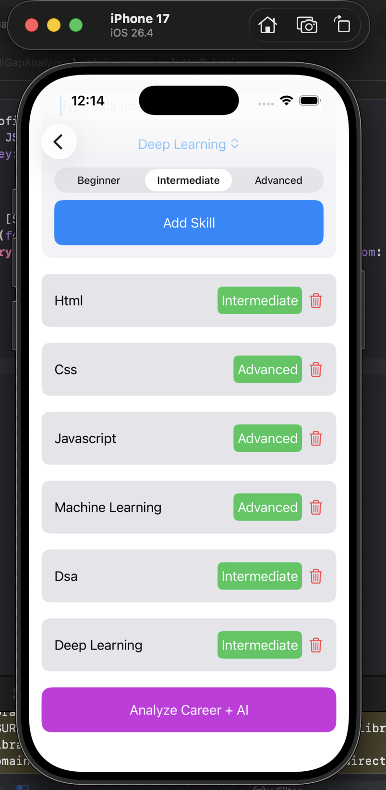
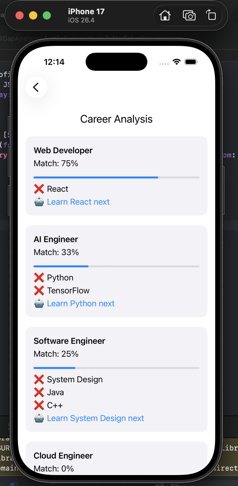

# Skill Gap Analyzer 🚀

An iOS app that helps users identify skill gaps and discover the best career path based on their current skills.

---

## ✨ Features

* 👤 Multi-profile support
* 🧠 Skill gap analysis
* 📊 Match percentage for jobs
* 🤖 Smart career suggestions
* 🎯 Best job recommendation
* 🎨 Clean SwiftUI interface

---

## 🛠 Tech Stack

* SwiftUI
* Swift
* UserDefaults (local storage)
* Xcode

---

## 🚀 How to Run

1. Clone this repository
2. Open `SkillGapAnalyzer.xcodeproj` in Xcode
3. Select a simulator
4. Click **Run ▶️**

---

## 📸 Screenshots

### 🏠 Homepage

  

  A clean and modern gradient landing screen that introduces the app. Users can start their journey by tapping the <b>Start</b> button.

---

### 👤 Profile Management

  

  Allows users to create and manage multiple profiles. Each profile can store a different set of skills.

---

### 🧠 Skill Selection

  

  Users can either type skills manually or select from a dropdown. Skill levels like Beginner, Intermediate, and Advanced can be assigned.

---

### ✅ Skills Overview

  

  Displays all added skills along with their levels. Users can easily remove incorrect entries using the delete option.

---

### 📊 Career Analysis

  

  Provides a detailed analysis of user skills against different career roles, showing match percentage, missing skills, and smart learning suggestions.

---

## 🎯 Future Improvements

* AI integration (ChatGPT API)
* Charts & analytics dashboard
* Firebase backend
* Resume export

---

## 👨‍💻 Author

* Anugrah
